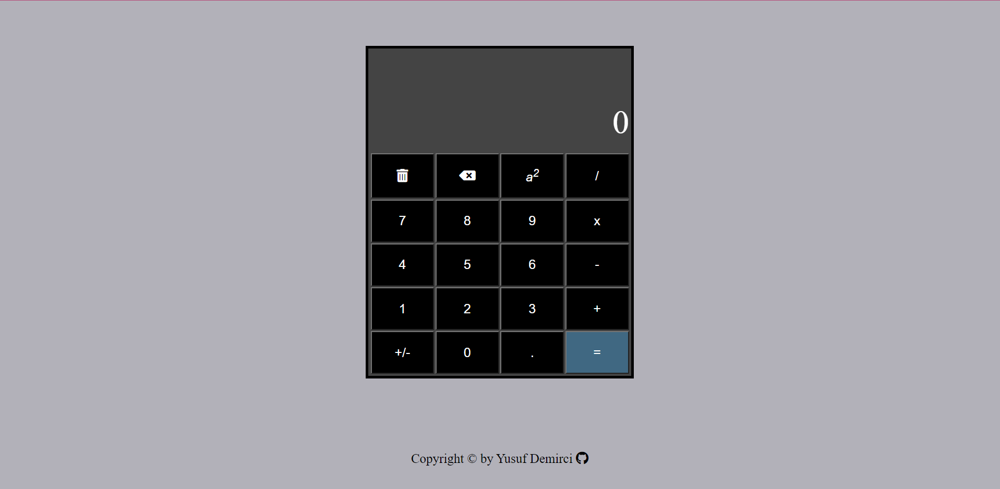

# Calculator

## Overview

### The challenge

Users should be able to:

- View the optimal layout for the component depending on their device's screen size
- See hover states for all interactive elements on the page
- Do mathematical calculations
- Use the calculator with mouse or keyboard

### Screenshot

### Links

- Live Site URL: [https://yusuf-demirci.github.io/Calculator/](https://yusuf-demirci.github.io/Calculator/)

### Built with

- Semantic HTML5 markup
- CSS custom properties
- Flexbox - Grid
- Mobile-first workflow
- JavaScript & JQuery
